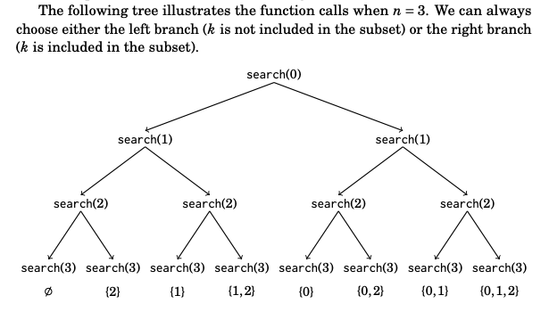
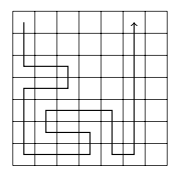

Competitive Programmer's Handbook Note's
===

* [Mathematics](#mathematics)
* [Time Complexity](#time-complexity) 
* [Sorting](#sorting) 
* [Data Structures](#data-structures) 
  * [Dynamic Arrays](#dynamic-arrays)
  * [Set Structures](#set-structures)
  * [Map Structures](#map-structures)
  * [Iterators and Ranges](#iterators-and-ranges)
  * [Other Structures](#other-structures)
* [Complete Search](#complete-search)
* [Greedy Algorithms](#greedy-algorithms)

## Mathematics
Important knowledge to know/review when solving programming problems.

### Sum Formulas

$\sum^n_{x = 1} x^k = 1^k + 2^k + 3^k + ... + n^k$

#### Arithmetic progressions

#### Geometric progressions

#### Harmonic sum

### Set Theory

#### Intersection:
Items in both A and B.

$A = \{1, 2, 5\} $ \
$B = \{2, 4\} $ \
$A \cap B = \{2\} $ 

#### Union:
Items in A and B or both.

$A = \{3, 7\}$ \
$B = \{2, 3, 8\}$ \
$A \cup B = \{2, 3, 4, 8\}$

#### Complement:
Elements that are not in A.

$U = \{1, ... , 10\}$ \
$A = \{1, 2, 3, 7\}$ \
$\overline{A} = \{4, 5, 6, 8, 9, 10\}$ 

#### Difference:
Elements that are in A but not in B.

$A = \{2, 3, 7, 8\}$ \
$B = \{2, 5, 8\}$ \
$A \backslash D = A \cap \overline{B} = \{2, 7\}$

#### Subset:
If each element of A belongs to S, we say that A is a subset of S. Denoted $A \subset S$.

### Logic 

### Functions

### Logarithms

## Time Complexity 

## Sorting

## Data Structures

### Dynamic Arrays
A **dynamic array** is an array whose size can be changed during the execution of the program (Similar to Python lists). 

#### Methods
```cpp
// initialize an empty vector
vector<int> v;

// append element to the back of the array using
// push_back(el) method.
// python: append(el)
v.push_back(3); // [3]
v.push_back(2); // [3,2]
v.push_back(5); // [3,2,5]

// indexing 
cout << v[0] << '\n'; // 3
cout << v[1] << '\n'; // 2
cout << v[2] << '\n'; // 5

// iterating through a vector
for(int i = 0; i < v.size(); i++){
  cout << v[i] << '\n';
}

// shorter syntax
for(int x : v){
  cout << x << '\n';
}

// back and pop_back 
// python: [-1] and pop()
vector<int> v;
v.push_back(5);
v.push_back(2);
cout << v.back() << '\n'; // 2
v.pop_back();
cout << v.back() << '\n'; // 5

// initialize a vector with elements
vector<int> k = {1, 2, 3, 4};

// size 10, initial value 0
vector<int> k(10);

// size 10, initial value 5
vector<int> v(10, 5);
```
#### Strings
The **string** structure is also a dynamic array that can be used almost like a vector. Strings can use the `+` operator `substr`, and `find(t)`.

```cpp
string a = "linear";
string b = a + a; 
cout << b << '\n'; // linearlinear
// unlike python strings c++ strings are mutable.
b[1] = 'z';
cout << b << '\n'; // lznearlinear

// find returns the first index of the
// given char
cout << b.find('z') << '\n'; // 1

// substr(staring intdex, length of substring)
// Unlike python you don't specify the ending 
// index rather the length of the substring.
string c = b.substr(2, 4);
cout << c << '\n'; // near
```

### Set Structures
A **set** is a data structure that maintains a collection of elements. Basic operations include insertion, search, and removal.

#### Implementations

The structure `set` is based on a balanced binary tree and its operations work in `O(log n)` time.

The structure `unordered_set` uses hashing, and its operations work in `O(1)` time on average.

| Differences | set | unordered_set | 
|-------------|-----|---------------|
Ordering | increasing  order (by default) | no ordering
Implementation  | Self balancing BST (Like Red-Black Tree)  | Hash Table
search time     | log(n)              | O(1) -> Average O(n) -> Worst Case
Insertion time  | log(n) + Rebalance  | Same as search
Deletion time   | log(n) + Rebalance  | Same as search

[Reference](https://www.geeksforgeeks.org/set-vs-unordered_set-c-stl/)

#### Methods
```cpp
// initialize empty set
set<int> s;
set<int> t = {1, 2, 3};

// append element
// python: append(el)
s.insert(1); 
s.insert(2);
s.insert(3);
cout << s.count(3) << '\n'; // 1 
cout << s.count(4) << '\n'; // 0

// remove element
// python: remove(el)
s.erase(3);
cout << s.count(3) << '\n'; // 0
```
Unlike vectors elements of sets cannot be accessed using [] notation. The

```cpp
// initialize set with elements
set<int> s = {1, 2, 3, 4};

// size() method returns the length of the set
// python: len(s)
cout << s.size() << '\n'; // 4

// prints each element in the set
for(auto x : s){
  cout << x << '\n';
}
```

All elements of a set are *distinct*, meaning they only occur once. Therefore, the method `count` always returns either 0 or 1. The method `insert` never adds a duplicate element to the set.

```cpp
set<int> s;
s.insert(5);
s.insert(5);
s.insert(5);
cout << s.count(5) << '\n'; // 1
```

#### Multiset
C++ also contains the structure `multiset` and `unordered_multiset` that work similarly to sets, but contain multiple instances of an element.

```cpp
multiset<int> s;
s.insert(5);
s.insert(5);
s.insert(5);
cout << s.count(5) << '\n'; // 3

s.erase(5);
cout << s.count(5) << '\n'; // 0

s.erase(s.find(5));
cout << s.count(5) << '\n'; // 2
```

### Map Structures
A **map** is generalized array that consists of key-value-pairs. In an array the keys are the index's 0,1,...,n-1 where n is the size of the array, the keys in a map can be any data type.

#### Implementations

The `map`is based on a balanced binary tree and accessing elements take `O(log n)`.

The `unordered_map` uses hashing and accessing elements takes `O(1)` time on average.

```cpp
map<string, int> m;
m["Ripple"] = 12;
m["Ellie"] = 6;
m["Forty"] = 2;
cout << m["Ellie"] << '\n'; // 6
```

If the value of the key is requested but the map does not contain it, the key is automatically added to the map with default value of 0.
```cpp
map<string, int> m;
cout << m["Kanou"] << '\n'; // 0
```

#### Methods
`count` checks if a key exists in a map:
```cpp
if(m.count("Kanou")){
  // key exists
}
```

To print all the keys and values:
```cpp
for(auto x : m){
  cout << x.first << " " << x.second << '\n';
}
```

### Iterators and ranges
An **iterator** is a variable that points to an element in a data structure.
```cpp
{ 3, 4, 6, 8, 12, 13, 14, 17 }
  ^                          ^
  |                          |
  s.begin()                  s.end()
```

#### Working with ranges 
Sorting vectors
```cpp
sort(v.begin(), v.end());
reverse(v.begin(), v.end());
random_shuffle(v.begin(), v.end());
```

Sorting arrays
```cpp
sort(a, a+n);
reverse(a, a+n);
random_shuffle(a, a+n);
```

#### Set iterators
The following code create an iterator `it` that points to the smallest element in a set:
```cpp
set<int>::iterator it = s.begin();

// Shorter way to write
auto it = s.begin();
```

iterator pointers can be accessed using the `*` symbol.
```cpp
auto it = s.begin();
cout << *it << '\n';
```

Iterators can be moved using the operators `++` (forward) and `--` (backwards). Thus, iterators can be used to print all the elements in increasing order:
```cpp
for(auto it = s.begin(); it != s.end(); it++){
  cout << *it << '\n';
}
```

`find(x)` returns an iterator that points to an element whose value is `x`. If the set does nto contain x, the iterator will be equal to `.end()`
```cpp
auto it = s.find(x);
if(it == s.end()){
  // x is not found
}
```

`lower_bound(x)` returns an iterator to the smallest element in the set whose value is *at least x*.

`upper_bound(x)` returns an iterator to the smallest element in the set whose value is *larger than x*.

Ex. Finds the element nearest to *x*:
```cpp
auto it = s.lower_bound(x);
if (it == s.begin()) {
  cout << *it << '\n';
} else if (it == s.end()) {
  it--;
  cout << *it << '\n';
} else {
  int a = *it; it--;
  int b = *it;
  if (x-b < a-x) cout << b << '\n';
  else cout << a << '\n';
}
```

### Other Structures 

#### Bitset
A **bitset** is an array whose each value is either 0 or 1.

Ex. Creates a bitset that contains 10 elements:
```cpp
bitset<10> s;
s[1] = 1;
s[3] = 1;
s[4] = 1;
s[7] = 1;
cout << s[4] << '\n'; // 1
cout << s[5] << '\n'; // 0
```

Bitsets only uses 1 bit of of memory per element while in a normal array 32 bits are allocated for each element. Additionally, bit operators can be used to efficiently manipulate bitsets.
```cpp
bitset<10> s(string("0010011010")); // from right to left
cout << s[4] << '\n'; // 1
cout << s[5] << '\n'; // 0

// Return the number of ones in the bitset
cout << s.count() << '\n'; // 4

// Using bit operations
bitset<10> a(string("0010110110"));
bitset<10> b(string("1011011000"));
cout << (a&b) << "\n"; // 0010010000
cout << (a|b) << "\n"; // 1011111110
cout << (a^b) << "\n"; // 1001101110
```

#### Deque
A **deque** is a dynamic array whose size can be efficiently changed at both ends of the array. 

Deque provides `push_back`, `pop_back`, `push_front`, and `pop_front`.
```cpp
deque<int> d;
d.push_back(5); // [5]
d.push_back(2); // [5,2]
d.push_front(3); // [3,5,2]
d.pop_back(); // [3,5]
d.pop_front(); // [5]
```

#### Stack
A **stack** is a data structure that provides two `O(1)` time operations for adding an element to the top and removing an element from the top. It is only possible to access the top element of a stack.
```cpp
stack<int> s;
s.push(3);
s.push(2);
s.push(5);
cout << s.top() << '\n'; // 5
s.pop();
cout << s.top() << '\n'; // 2
```

#### Queue
A **queue** also provides two `O(1)` time operations for adding an element to the end and removing the first element.
```cpp
queue<int> q;
q.push(3);
q.push(2);
q.push(5);
cout << q.front() << '\n'; // 3
q.pop();
cout << q.front() << '\n'; // 3
```

#### Priority Queue
A **priority queue** maintains set of elements. Insertion and removal take `O(log n)` time, and retrieval takes `O(1)` time.

```cpp
priority_queue<int> q;
q.push(3);
q.push(5);
q.push(7);
q.push(2);
cout << q.top() << "\n"; // 7
q.pop();
cout << q.top() << "\n"; // 5
q.pop();
q.push(6);
cout << q.top() << "\n"; // 6
q.pop();
```

## Complete Search
**Complete search** implements a brute force search that generates all possible solutions to the problem and then selects the best solution or count the number of solutions, depending on the problem.

If complete search is too slow, other techniques, such as greedy algorithms or dynamic programming can be used.

### Generating subsets
Problem covered in [leetcode 78](https://leetcode.com/problems/subsets/) we want to generate all the subsets of a given set. For example, the subsets of `{1, 2, 3}` are `{}, {1}, {2}, {3}, {1, 2}, {1, 3}, {2, 3} and {1, 2, 3}`

#### Method 1
Use recursion. The follow function `search` generates the subsets of the set `{0, 1, ..., n - 1}`. 

```cpp
void search(int k){
  if (k == n){
    // process subset
  } else {
    search(k+1);
    subset.push_back(k);
    search(k+1);
    subset.pop_back();
  }
}
```



#### Method 2
Another way to generate subsets is based on bit representation of integers. For example, the bit representation 25 is 11001, which corresponds to the subset {0, 3, 4}.

```cpp
for (int b = 0; b < (1<<n); b++){
  // process subset
}

// Using bit sequence
for (int b = 0; b < (i<<n); b++){
  vector<int> subset;
  for (int i = 0; i < n; i++){
    if (b&(1<<i)) subset.push_back(i);
  }
}
```

### Generating permutation
Permutations of {0, 1, 2} are (0, 1, 2), (0, 2, 1), (1, 0, 2), (1, 2, 0), (2, 0, 1), and (2, 1, 0). Two approaches: Recursion or go through the permutations iteratively.

#### Method 1
```cpp
void search() {
  if (permutation.size() == n){
    // process permutation
  } else {
    for (int i = 0; i < n; i ++){
      if (chosen[i]) continue;
      chosen[i] = true;
      permutations.push_back(i);
      search();
      chosen[i] = false;
      permutation.pop_back();
    }
  }
}
```

#### Method 2
```cpp
vector<int> permutation;
for (int i = 0; i < n; i++){
  permutation.push_back(i);
}
do {
  // process permutation
} while (next_permutation(permutation.begin(), permutation.end()));
```

### Backtracking
A **backtracking** algorithm begins with an empty solution and extends the solution step by step.

Implementation:
```cpp
void search(int y){
  if (y == n){
    count++;
    return;
  }
  for (int x = 0; x < n; x++){
    if (column[x] || diag1[x + y] || diag2[x-y+n-1]) continue;
    column[x] = diag1[x+y] = diag2[x-y+n-1] = 1;
    search(y+1)
    column[x] = diag1[x+y] = diag2[x-y+n-1] = 0;
  }
}
```

### Pruning the search
The idea is to add "intelligence" to the algorithm so that it will notice as soon as possible if a partial solution cannot be extended to a complete solution.

#### Optimization 1
We know that the paths are symmetric about the diagonal of the grid. So, we can decide that we always first move one step down or right which reduces are search spaces. Then we multiply the solution by two to make up for the symmetric solutions.

#### Optimization 2
If the lower-right square is reached before all other nodes.

#### Optimization 3
If the path touches a wall and can turn either left or right, the grid splits into two parts that contain unvisited squares.

Example:


#### Optimization 4
The idea of Optimization 3 can be genetalized: if the path cannot continue forward but can turn either left or right, the grid splits int two parts that both contain unvisited squares.

This is a usual phenomenon in backtracking, because the search tree is usually large and even simple observations can effectively prune the search.

### Meet in the middle
**Meet in the middle** is a technique where the search space is divided into two parts of about equal size. A separate search is performed for both parts and the results are combined.

#### Example:
Go through all subsets of the elements and check if the sum of the subsets is x. $O(2^n)$, because there are $2^n$ subsets. Using meet in the middle technique, we can achieve $O(n^{n/2})$.

Divided both the lists into A and B such that both lists contain about half of the numbers. The first search generates all subsets of A and stores their sums to a list S_A$. Correspondingly, the second search creates a list $S_B$ from B. After this, it suffices to check if it is possible to choose one element from $S_A$ and another element from $S_B$ such that their sum is x.

## Greedy algorithms

